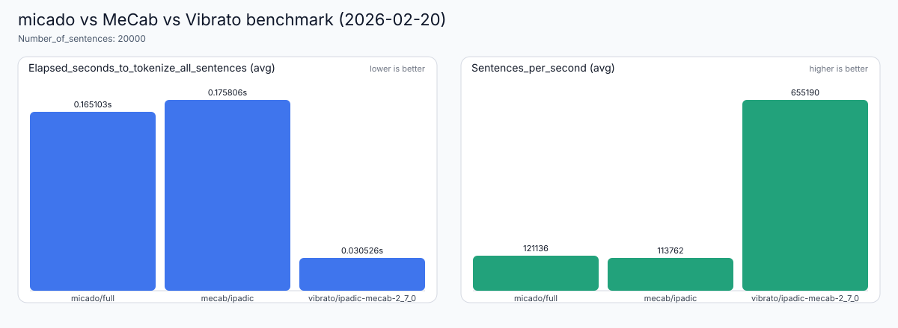

# micado

`micado` は、MoonBit で実装している日本語形態素解析プロジェクトです。

- ライセンス: `Apache-2.0`（`LICENSE`）
- GitHub Pages Demo: [https://trkbt10.github.io/moon-jamorph/](https://trkbt10.github.io/moon-jamorph/)

## できること

- `src/tokenizer` で日本語テキストを形態素に分割
- `cmd/main` で MeCab 辞書ディレクトリ（`--dicdir`）を使った CLI 実行
- `npm/micado-wasm` で Wasm + `.dic.bin` のブラウザ向け配布

## 形態素解析器の比較（概要）

この表は、主要な日本語形態素解析器の設計思想と実装上の違いを、実装方式の観点で並べたものです。
`micado` は現時点で完全互換を目的にしているわけではありませんが、方向性としては **MeCab 系（DA + Viterbi + 連接コスト）** に近い設計を採っています。
軽量な `dic.bin` プロファイル（`tiny/mini/medium`）は配布サイズを優先するため、`full` と比べて精度が落ちる場合があります。`full` は参照精度、`tiny/mini/medium` は用途別のトレードオフ用です。

| 項目 | **micado** | **MeCab** | [ChaSen](http://chasen.naist.jp/) | [JUMAN](http://pine.kuee.kyoto-u.ac.jp/nl-resource/juman.html) | [KAKASI](http://kakasi.namazu.org) |
|---|---|---|---|---|---|
| 解析モデル | bi-gram マルコフモデル | bi-gram マルコフモデル | 可変長マルコフモデル | bi-gram マルコフモデル | 最長一致 |
| コスト推定 | MeCab辞書から取得 | コーパスから学習 | コーパスから学習 | 人手 | コストという概念なし |
| 学習モデル | -（辞書依存） | [CRF](http://www.cis.upenn.edu/~pereira/papers/crf.pdf)（識別モデル） | HMM（生成モデル） | - | - |
| 辞書引きアルゴリズム | Double Array | Double Array | Double Array | パトリシア木 | Hash? |
| 解探索アルゴリズム | Viterbi | Viterbi | Viterbi | Viterbi | 決定的? |
| 連接表の実装 | 2次元 Table（圧縮ID） | 2次元 Table | オートマトン | 2次元 Table? | 連接表なし? |
| 品詞の階層 | 簡易列挙型 + mecab_feature | 無制限多階層品詞 | 無制限多階層品詞 | 2段階固定 | 品詞という概念なし? |
| 未知語処理 | 字種（複数候補生成） | 字種（動作定義を変更可能） | 字種（変更不可能） | 字種（変更不可能） | - |
| 制約つき解析 | 不可能 | 可能 | 2.4.0 で可能 | 不可能 | 不可能 |
| N-best 解 | 不可能 | 可能 | 不可能 | 不可能 | 不可能 |

補足:
- この比較は MeCab 作者サイト等で知られている実装比較を要約したものです。
- `micado` の開発目標は、上記のうち MeCab 系の実用上重要な要素（辞書引き・スコアリング・探索）を段階的に高精度化することです。

## ディレクトリ構成

```text
.
├── src/
│   ├── scanner/utf16, scanner/utf8
│   ├── core/da_trie, lattice, scorer, unknown, viterbi
│   ├── tokenizer
│   └── types
├── cmd/
│   ├── main          (MeCab dicdir を使う CLI)
│   ├── tokenize      (stdin を内部 tokenizer で処理する CLI)
│   ├── ipadic_demo   (standard edition demo)
│   ├── neologd_demo  (full edition demo)
│   ├── wasm_api      (wasm 線形 ABI)
│   └── bench
├── tools/
│   ├── dict-compiler
│   ├── distribution
│   └── benchmark
├── bench/corpus
├── bench/lexmatch_vs_manual, bench/throughput
└── npm/micado-wasm
```

## 主要 API

`src/tokenizer`:

- `Tokenizer::new()`
- `Tokenizer::set_edition(...)`
- `Tokenizer::set_mode(...)`
- `Tokenizer::set_use_lexmatch_scanner(...)`
- `Tokenizer::tokenize(String)`
- `Tokenizer::tokenize_utf8(BytesView)`
- `EDITION_NANO` / `EDITION_MINI` / `EDITION_STANDARD` / `EDITION_FULL`
  - 互換のため残しています（`src/dict` 廃止後は同一挙動）。

`src/types`:

- `Morpheme { surface, pos, pos_detail, mecab_feature, start_pos, end_pos }`

## 開発用コマンド

```sh
moon info
moon fmt
moon test
moon check
```

## 実行時スモーク検証（CLI + Wasm）

外付け MeCab 辞書 (`--dicdir`) と `.dic.bin` の両方を一度に検証:

```sh
tools/distribution/verify_cli_wasm.sh
```

- CLI (`cmd/main`, native target) を実行し、JSON/分かち書き出力を検証
- 非UTF-8辞書（例: `ipadic`）は `config-charset` を検出して UTF-8 へ変換
- Wasm + `.dic.bin` をビルドして Node スモークを実行
- 入力文は `npm/micado-wasm/demo/smoke-sentence.txt` を CLI/Wasm で共通利用
- CI では `.github/workflows/runtime-smoke.yml` から同じ検証を実行

## 実行方法

`ipadic_demo`:

```sh
moon run cmd/ipadic_demo
```

`neologd_demo`:

```sh
moon run cmd/neologd_demo
```

MeCab `dicdir` を使う CLI（`cmd/main`）:

```sh
moon run --target native cmd/main -- -d /path/to/mecab/dic -O mecab "吾輩は猫である。"
moon run --target native cmd/main -- -d /path/to/mecab/dic -O json "太郎は走った。"
```

`cmd/main` では `--dicdir` が必須です。native/llvm 以外では stub 実装になります（`cmd/main/moon.pkg.json`, `mecab_runner_stub.mbt`）。

内部 tokenizer を stdin から実行する CLI（`cmd/tokenize`）:

```sh
cat bench/corpus/aozora_openings.txt | moon run --target native cmd/tokenize -- -e full -O count
```

## 軽量ベンチ比較

`tools/benchmark/run_all.sh` を実行すると、`micado` / `mecab` / `vibrato` の比較を回して
結果テキストと SVG グラフを自動生成します。

```sh
tools/benchmark/run_all.sh --dicdir /opt/homebrew/lib/mecab/dic/ipadic
```

生成物:

```text
bench/benchmark/quick_compare_latest.txt
bench/benchmark/quick_compare_latest.svg
```

実測結果（macOS, 2026-02-20, Apple Silicon / `--runs 10 --trials 10 --copies 2000`）:

```text
[micado/full]
Warmup: 0.164868
Number_of_sentences: 20000
Elapsed_seconds_to_tokenize_all_sentences: [0.161626,0.165103,0.170895]
Sentences_per_second: [117030.93,121136.50,123742.47]

[mecab/ipadic]
Warmup: 0.181750
Number_of_sentences: 20000
Elapsed_seconds_to_tokenize_all_sentences: [0.173248,0.175806,0.181069]
Sentences_per_second: [110455.13,113761.76,115441.45]

[vibrato/ipadic-mecab-2_7_0]
Warmup: 0.034950
Number_of_sentences: 20000
Elapsed_seconds_to_tokenize_all_sentences: [0.029864,0.030526,0.031819]
Sentences_per_second: [628564.40,655189.58,669694.52]
```



## 辞書運用方針

`src/dict` は廃止済みです。

- ネイティブCLIは外付け MeCab 辞書（`--dicdir`）を利用します。
- Web/npm は `.dic.bin` を実行時ロードします。
- `tools/dict-compiler/scripts/build_*_generated.sh` は廃止され、実行するとエラー終了します。

## Wasm / npm 配布

配布ディレクトリは `npm/micado-wasm` です。

- JS エントリ: `index.mjs`
- dic.bin ローダ: `dic-bin.mjs`（I/Oのみ）
- 生成物: `dist/micado_wasm.wasm`, `dist/*.dic.bin`, `dist/*.dic.bin.deflate`
- `dic.bin` は `surface/mecab_feature/left_id/right_id/word_cost` を保持する現行フォーマットのみサポート（旧形式との互換は持たない）
- 形態素解析ロジック本体は MoonBit wasm 側に統一（`dic-bin.mjs` に解析実装は持たない）

生成コマンド:

```sh
tools/distribution/build_wasm_npm.sh
```

または `npm/micado-wasm` で:

```sh
npm run build:wasm
```
